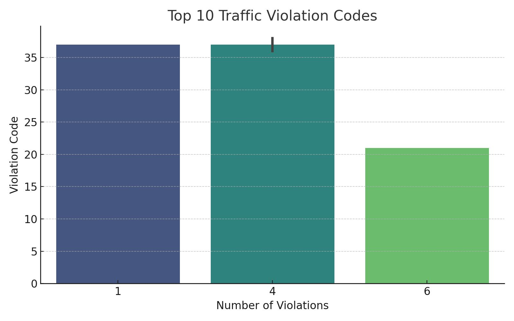
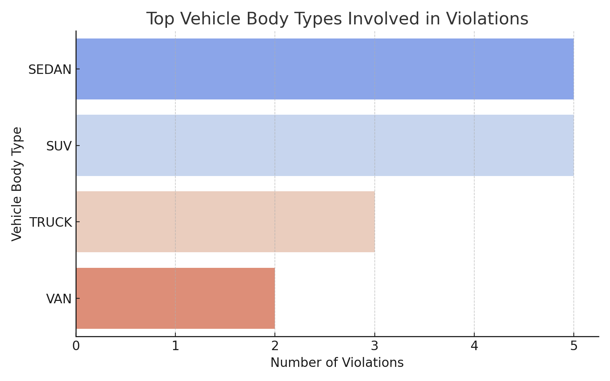

# 🚦 Traffic Violation Insights

This project analyzes traffic violation data from New York City to find patterns in vehicle types, violation codes, and violation locations. It uses Python to clean the data, generate charts, and visualize hotspots on a heatmap.

## 📊 Key Features
- Top 10 violation codes bar chart
- Most common vehicle body types involved
- Heatmap of traffic violation locations

## 📁 Dataset
[NYC Open Data - Parking Violations](https://data.cityofnewyork.us/resource/h9gi-nx95.csv)

## 🛠 Tools Used
- Python
- Pandas
- Matplotlib
- Seaborn
- Folium

## ▶️ How to Run
1. Clone this repository  
2. Install required packages  
3. Run `traffic_violations.py` to generate visualizations
## 📊 Output Visualizations

### Top Violation Codes

### Vehicle Body Types

## 🛡 License

This project is licensed under the MIT License - see the [LICENSE](LICENSE) file for details.

## 📬 Contact
Feel free to connect via [LinkedIn](https://www.linkedin.com/in/vikash-sharma-284191230?lipi=urn%3Ali%3Apage%3Ad_flagship3_profile_view_base_contact_details%3Br6MbwtyyRBid4X8rxz1TGw%3D%3D)
